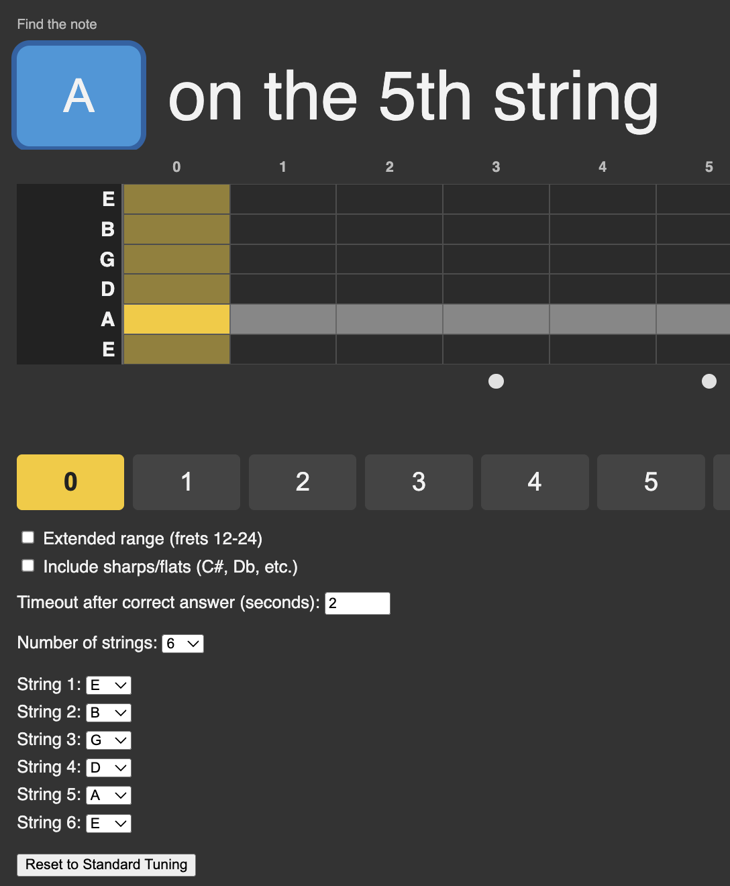

# Guitar Fretboard Flashcard Game

A compact browser tool to practice and memorize notes on a 3- to 12-string guitar-style fretboard.

## Features

- Practice identifying notes on any string and fret
- Choose normal (12-fret) or extended (24-fret) ranges
- Optionally include sharps/flats in quizzes
- 3–12 strings with ready-made presets and per-string custom tuning
- Reset tuning to standard 6-string configuration
- Visual cues and audio feedback for correct/incorrect answers
- Settings persist across browser sessions so your preferences are retained

## Deployment

- Live at: https://ledentsov.de/js/learn-the-fretboard/

## Quick start

- Open `src/static/index.html` in a browser for a quick run.
- Or serve the repo root with a simple static server:
  - Python 3: `python -m http.server 8000` then open `http://localhost:8000/src/static/index.html`
  - Node: `npx http-server .` then open the corresponding URL.

## Inspiration

Inspired on a whim by Steve Vai's anecdote about the first homework given to him by Joe Satriani: "learn all notes on the fretboard".

## Tests

- Cypress spec: `cypress/e2e/spec.cy.js`.
- Run tests:
  - Interactive: `npm run cy` or `npx cypress open --e2e`
  - Headless: `npm run e2e`or `npx cypress run --e2e`

## Notes for iOS users

- On iOS devices you may need to tap the "enable sound" banner to hear tones.
