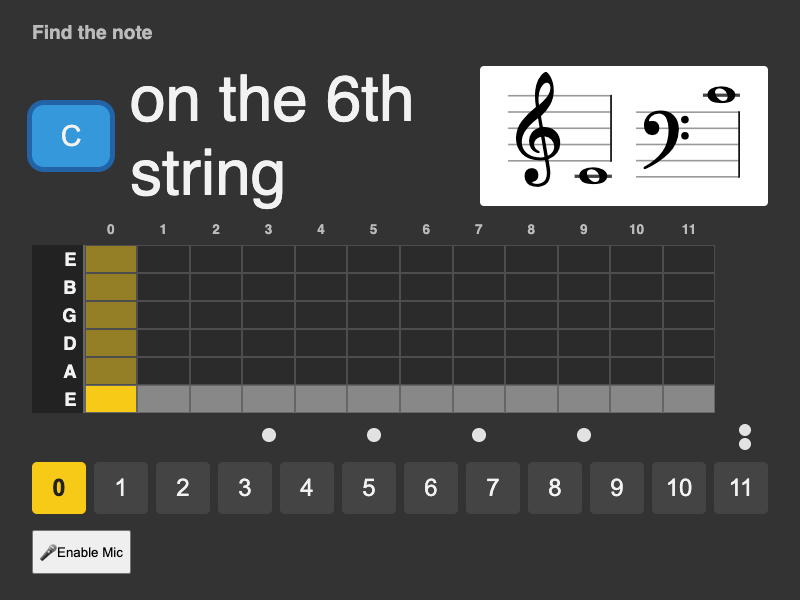

# Guitar Fretboard Flashcard Game

A compact browser-based tool to practice and memorize notes on a 3- to 12-string guitar-style fretboard.


[](https://app.fossa.com/projects/git%2Bgithub.com%2Fd-led%2Ffret-flashcards?ref=badge_shield)

## Features

- Practice identifying notes on any string and fret.
- Choose between a basic 0-11th fret practice or 21, 22 or 24 frets with multiple notes to find on one string.
- Optionally include sharps/flats in quizzes.
- 3–10 strings with ready-made presets and per-string custom tuning.
- Reset tuning to standard 6-string configuration.
- Visual cues and audio feedback for correct/incorrect answers.
- Settings persist across browser sessions so your preferences are retained.
- Optional quiz bias towards strings of the current tuning with the most mistakes.
- You don't actually need a stringed instrument for practicing at all: try turning on the score notation and turning off the quiz note hint. Sing or play it on any instrument!
- You don't have to look at the monitor either: enable the synthetic "voice hints" (might not work in all browsers).

## Deployment

- Live at: https://d-led.github.io/fret-flashcards

## Quick start

- run `npm i && npm build`
- Open `src/dist/index.html` in a browser for a quick run.
- Or serve the dist folder with a simple static server:
  - Python 3: `python3 -m http.server 8000 -d dist` then open `http://localhost:8000`
  - Node: `npx http-server ./dist` then open the corresponding URL. (`npm run serve`)

## Inspiration

Inspired by Steve Vai's anecdote about the first homework given to him by Joe Satriani: "learn all notes on the fretboard".

## Tests

- Cypress spec: `cypress/e2e/spec.cy.js`.
- Run tests:
  - Interactive: `npm run cy` or `npx cypress open --e2e`
  - Headless: `npm run e2e`or `npx cypress run --e2e`

## Mobile Apps (Android & iOS)

**String Homework Tutor** is now available as native mobile apps for Android and iOS! Built with Capacitor for maximum code reuse (95%+ of your existing code works unchanged).

### 🚀 Quick Mobile Start

```bash
# Install dependencies
npm install

# Build and sync for mobile
npm run build:mobile

# Run on Android (requires Android Studio)
npm run android:dev

# Run on iOS (requires Xcode on macOS)
npm run ios:dev
```

### 📱 Mobile Features

- **Haptic Feedback**: Vibration for correct/incorrect answers and button taps
- **Native Performance**: Full native app experience with web development speed
- **App Store Ready**: Deploy to Google Play Store and Apple App Store
- **Touch Optimized**: All interactions work perfectly on touch screens
- **Enhanced Storage**: Better data persistence with native APIs
- **App Lifecycle**: Smart audio pause/resume when app goes to background

### 🛠️ Development Commands

| Command                 | Description                                 |
| ----------------------- | ------------------------------------------- |
| `npm run build:mobile`  | Build web assets + sync to mobile platforms |
| `npm run android:dev`   | Build and run on Android device/emulator    |
| `npm run ios:dev`       | Build and run on iOS device/simulator       |
| `npm run android:build` | Build Android APK for production            |
| `npm run ios:build`     | Build iOS app for production                |
| `npm run mobile:sync`   | Sync web assets to mobile platforms         |

### 📋 Prerequisites

#### Android Development

- Android Studio (latest version)
- Android SDK (API level 33+)
- Java Development Kit (JDK 11+)

#### iOS Development (macOS only)

- Xcode (latest version)
- iOS SDK (iOS 13.0+)
- CocoaPods: `sudo gem install cocoapods`

### 🏗️ Building for Production

#### Android (Google Play Store)

1. Run `npm run build:mobile`
2. Open in Android Studio: `npx cap open android`
3. Generate signed AAB file in Android Studio
4. Upload to Google Play Console

#### iOS (App Store)

1. Run `npm run build:mobile`
2. Open in Xcode: `npx cap open ios`
3. Archive and upload from Xcode
4. Submit for review in App Store Connect

### 📖 Detailed Mobile Guide

For comprehensive mobile development instructions, see [mobile_development.md](./docs/development/mobile_development.md)

## Notes for iOS users

- On iOS devices you may need to tap the "enable sound" banner to hear tones.

## License

[](https://app.fossa.com/projects/git%2Bgithub.com%2Fd-led%2Ffret-flashcards?ref=badge_large)
